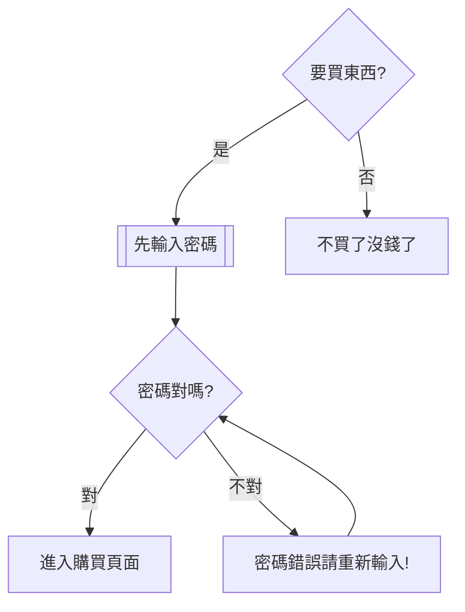

## Python 小科普

#### 變數
    標示符 => 自定義變量名稱 ，不可以數字開頭
    變量 => 儲存數據 => 容器
    變量可變 => 可重新賦值 => 每個變量都必須被賦值
    常量固定 => 不可被重新賦值 => 在python中沒有嚴格意義
    通常會將常量的標示符所有的字母全部大寫，當變量名字全部都大寫，標示符默認是一個常量，且不可修改數值。
    
    
```python=
#python無須指定變量類型
 price = 68.4 # float
 count = 2 # int 
 name = "meow" #str  '' "" "" """ """ 引號中的內容 都是字符串類型
 on_sale = True # 未知兩種結果 True / False bool
 
#通過type()查看變量類型
print(type(price))

#查看python已定義關鍵字，變數命名不可跟關鍵字重名
import keyword
print(keyword.kwlist) # 輸出關鍵字列表

['False', 'None', 'True', '__peg_parser__', 'and', 'as', 'assert', 'async', 'await', 'break', 'class', 'continue', 'def', 'del', 'elif', 'else', 'except', 'finally', 'for', 'from', 'global', 'if', 'import', 'in', 'is', 'lambda', 'nonlocal', 'not', 
'or', 'pass', 'raise', 'return', 'try', 'while', 'with', 'yield']

print(len(keyword.kwlist)) # 36

```

**變量輸出**

```python=
print("meow")
name = "ME"
age = 87
gender = 'boy'
print(name, age, gender) # Me 87 boy
print(name, age, gender,sep="") # Me87boy
print(name, age, gender,sep="*") # Me*87*boy
print(name, age, gender, sep="*", end="\n") #\n是跳行 , end="" 這樣的話不會換行輸出 

print("meow: \" I want eat some food! \"") # meow: " I want eat some food "
print('meow: \" I want eat some food! \"') #單雙引號嵌套使用  meow: " I want eat some food "
``` 
    
**字串拼接**   
```python=
a = "老"
b = "王"
c = 5487
print(a+b)
print(a*5) # 老老老老老
#print(a-b) #字串之間不可用 - 進行操作

# 格式化輸出 %s %d %f 輸出一個% => %%
# 站位符
print("你好! %s %s %s" % (a,b,c)) #你好! 老 王 5487 (這裡會將int強制轉成string)
```
**型態**
```python=
number_1 = 1234 #當我們想要輸出001234時...
print("我的學號是: %06d" % number_1) # %06d 輸出的十進制整數位6位,不足的位補0
score = 59.5
print("我期末英語成績 : %f" % score) # %f表示一個符點數，默認小數後面有6位 59.500000
print("我期末英語成績 : %.2f" % score) #只想小數後留2位 59.50

# 定義一個小數scale = 0.2, 輸出: 數據比例是20.00%
scale = 0.2
print("數據比例是: %.2f%%" % (scale*100))#數據比例是: 20.00% #scale*100 要加括號 否則 會把前面的話 輸出100遍 %%表示輸出一個%

```

**format**
```python=
name = "meow"
gender = '女'
age = 18

print("姓名: %s, 性別: %s:, 年齡: %d" %  (name,gender,age))

#{}不帶編號
print("姓名: {} ,性別: {} ,年齡: {}".format(name,gender,age))

#{1}{2}有數字標號的
print("姓名: {} , 性別:{},年齡: {}, 姓名是啥來著{}".format(name,gender,age,name))
#編號以0開頭 有了數字以後，變量就可以被反覆使用
print("姓名: {0} , 性別:{1},年齡: {2}, 姓名是啥來著{0}".format(name,gender,age,name))#姓名: meow , 性別:女,年齡: 18, 姓名是啥來著meow

#用數字標號表示會出現順序上的問題
#可以使用標示名稱的方式
print("姓名: {meow} , 性別:{xingbie},年齡: {age}, 姓名是啥來著{meow}".format(meow=name,xingbie=gender,age=age)) #姓名: meow , 性別:女,年齡: 18, 姓名是啥來著meow

#定義整數變量 student_no,輸出:我的學號000004
student_no = 4
print("我的學號: %06d" % student_no)
print("我的學號: {:06d}".format(student_no)) #我的學號: 000004

#定義小數price,weight,money, 輸出 : 波羅單價9.00元/斤,購買了5.00斤,需要支付45.00元9.00
price = 9.00
weight = 5.00
money = 45.00

print("波羅單價%.2f元/斤,購買了%.2f斤,需要支付%.2f元" % (price,weight,money))
print("波羅單價{:.2f}元/斤,購買{:.2f}斤,需要支付{:.2f}元".format(price, weight, money)) #波羅單價9.00元/斤,購買5.00斤,需要支付45.00元

# 定義一個小數scale = 0.2, 輸出: 數據比例是20.00%
scale = 0.2
print("數據比例是{:.2f}%".format(scale*100)) #數據比例是20.00%

```

**輸入**
```python=
# input 默認沒有提示語句
name = input()
print(name)

#給了提示語句會被打印出來，不會自動換行
name = input("輸入名字 :　")　＃把鍵盤輸入的str賦值給name
print(name)

#input語句接收的內容是以字串形式存在的
#類型轉換
int(x) #將x轉換為整數
float(x) #將x轉換為符點數
```

**項目演練**
```python=
#遊戲:被鵝追
#輸入玩家名稱:
#輸入密碼:
#輸入充值帳號:
print("被鵝追")
name = input("輸入玩家名稱: ") # 輸入玩家名稱: meow
passwd = input("輸入密碼: ")

print("%s 請充值才可加入遊戲! " % name) # meow 請充值才可加入遊戲! 
coins = input("輸入充值金額: ") # 輸入充值金額: 1000
coins = int(coins)#類型轉換
print("%s充值成功! 當前儲了:%d,請開始遊戲!" %(name,coins)) #meow充值成功! 當前儲了:1000,請開始遊戲!

#遊戲:英雄聯盟
#輸入角色
#輸入擁有裝備
#輸入想購買裝備
#輸入金額
print("英雄聯盟")
role = input("輸入角色: ")
equiment = input("輸入擁有裝備:　")
print("{}當前擁有{}".format(role,equiment))
upgrade_equiment = input("輸入想購買裝備: ")
pay = input("請輸入金額: ")
equiment = upgrade_equiment

print("{}擁有{},此裝備花了{}".format(role,equiment,pay))
```

**內存地址**
```python=
n = "meow"
s = n
print(n)

#每次運行都是不一樣的內存地址，但n跟s都會一樣的地址值，指向同個內存位置
print(id(n)) #2014419339760
print(id(s)) #2014419339760


n = "meow"
s = n
print(id(n)) #s = "meow" 1923566382832

n = "nomeow"
#n在內存中另外開了一個位址
print(id(n)) #n = "nomeow" 1923566382576
print(id(s)) #s = "meow" 1923566382832

#使地址反覆使用多次
money = 10
money1 = 10
print(id(money)) #1750925470288
print(id(money1)) #1750925470288

#但交互式interpreter時會因為數值過大而內存就會另開空間
meow = 1000000
meow1 = 1000000
print(id(meow))
print(id(meow1))

#使用交互式interpreter 開闢空間的方式 分為小整數和大整數空間
#使用小整數時會使用地址的覆用(-5~257)，大整數會重新開闢空間
```

**運算符**
```python=
# % ->取餘數
# // ->取商整數
#()中的運算符有最高優先權，再來是** > * > / > % > // > + > -

# 使用關係運算符的表達式最終返回一個 bool 型的結果 true False
a = 10000
b = 10000
a == b
>>　true　＃表示ａ、ｂ值相同

ａ is b #判斷a、b地址是否相同 is是身分運算符，用於判斷兩變量id
>> false

n1 = 8
n2 = 5 
n3 = 3
result = n1 >= (n2 + n3) and n1 > n2 #true and true => true

n2 += n3 #n2 = n2+n3 =>8
result = n1 >= n2 and n1 == n3 #true and false => false

n4 = (n1 + n3) - n2 #(8 + 3) - 8 =>3
result = n4 < n1 and (n4 + n3) > n2 #true and false => false

# if...else
a = 6
b = 5

#如果是true則將if前面的內容進行運算，並將結果賦值或成result
#如果是false則將else後面的內容進行運算，並將結果賦值或成result

result = (a + b) if a > b else (b - a)
print(result) #11

```
**條件判斷**

    if 搜索商品:
       先輸入密碼
       if 密碼正確:
          進入購買頁面
       else: 密碼錯誤，重新輸入密碼
    else: 不買了

```python=
#code 縮排為一個tab或四個空白鍵
#python規定: 判斷的變量是" "、0、 None默認是False，"meow"有值則認為是True

#登入頁面
username =  " " #默認表示False
if username != " ":
#if username: #username == False
    print("成功登入")
print("下次再來")

#小遊戲登入

print("*0"*10+"歡迎新玩家"+"*"*10)
level = input("請輸入當前級別(lv1、lv2)")
if level == "lv1":
    print("遊戲順利~")
else:
    print("請先充值")
    money = int(input("請充值: "))
    
    #再增加一個判斷:充值金額是否是50的倍數: 是:遊戲繼續 否:重新充值
    if money % 50 == 0:
        print("充值金額是{}元\n祝你遊戲愉快".format(money))
    else:
        print("重新充值，金額有誤")
       
#else: 猜數字
#產生一個隨機數
#鍵盤輸入一個數字
#將系統產生的數字和鍵盤輸入的數字做比較
#猜對了:中獎、猜錯了:掰掰下次再來

import random #亂數產生
run = random.randint(1,10) #產生1~10內的亂數
num = int(input("請輸入一個數字: "))

if num == run:
    print("猜中嘞")
else:
    print("猜錯嘞,再一次")
print("數字是{}".format(run))

#elif 多層條件判斷
考試成績評測
> 成績>=90 : A
> 90>成績>=80 : B
> 80>成績>=70 : C
> 70>成績>=60 : D
> 成績<60 :Ｅ

while True:
    score = input("輸入考試成績(1~100): ")
    test = int(score)
    if score.isdigit():
        if 0 < test <= 100:
            if test >= 90 and test >= 100:
                print("A")
                break
            elif test >= 80:
                print("B")
                break
            elif test >= 70:
                print("C")
                break
            elif test >= 60:
                print("D")
                break
            elif test < 60 and test >= 0:
                print("E")
                break
            else:
                print("請重新輸入正確數值")
                continue
        else:
            print("請輸入1~100內的分數")

```
    if 條件 1:
        #條件1滿足執行的代碼
        if 條件 1 基礎上的條件 2:
            ...#條件 2 滿足執行的代碼
        
        else: #條件 2 不滿足的處理
            條件 2 不滿足時，執行的代碼
    else: #條件 1 不滿足的處理
        條件 1 不滿足時，執行的代碼

**循環語句**
一般情況下，需要錯重複執行的code，都可以用循環的方式完成
(循環不是必要使用的，但是為了提高代碼的重複使用率，而使用)

```python=
for循環作為編程語言最強力的特徵之一
for循環較多用於次數可知情況下
python可以使用for語句循環遍歷整個序列的值

    關鍵字 元素 關鍵字 集合
    for   item  in    iterable:
        do something

range()函數 -> range(起始值 結束值,指定數字間隔)
該函數是python的內置函數，用於生成一系列連續的整數，大多用於for循環語句中
range(8) 起始值可以省略，默認從0開始 -->0,7 包前不包後，間隔可以省略，默認是1

#range(start, end, step= 1)
#range(start, end)
#range(end)

#range(0)是空集合

#打印三次hello

for i in range(3):  # 定義i，用於接收集合中的每一個元素，當接收一個元素時，就會執行一次
    '''
    i是一個變量 
    i = 0
    i = 1
    i = 2
    '''
    print("hello")  # 循環體


#小李超餓，要吃五個饅頭，顯示每次吃饅頭的過程，當小李吃完五個饅頭，顯示小李吃飽了

for i in range(1, 6):
    print("小李很餓，正在吃第{}個饅頭".format(i))
print("小李說:\"終於吃飽了\"")

'''
吃饅頭，在第三個饅頭上加了"砒霜"
當吃到了第三個饅頭的時候，提示:不要吃!有毒
'''
for i in range(1, 6):
    if i == 3:
        print("不要吃!有毒")
        break #結束循環，else內部語句就不會被輸出
    else:
        print("小李很餓，正在吃第{}個饅頭".format(i))
    
'''
用戶帳密登入只能登入三次，三次未成功則帳戶鎖定
輸入正確就進入後台
'''
for i in range(1, 4):
    inputlogin = input("請輸入帳號: ")
    inputpass = input("請輸入密碼: ")
    if inputpass == "admin" and inputlogin == "meow":
        print("成功登入")
        break
    else:
        print("請在輸入一次帳密")
else:
    print("帳號鎖定")
    
#pass空語句
if 10 > 7:
    print("結果正確!")

else:
   #正常來說如果這裡是空的，程序會報錯
    pass #不會做任何事情，相當於代碼的佔位，保證代碼結構的完整性，在語     法上也不會報錯
print("程序判斷成功")

#while較多用於次數未知情況下
while True: #True循環條件
    print("test")

#死循環 當循環條件一直為true，就會一直執行循環:並且沒有一個機制可以打破循環

#打印五遍meow
#1.定義重複次數計數器
i=0
#2.使用while判斷條件
while i < 5:
    #需要執行代碼
    print("meow")
    #處理計數器i
    i += 1
print("循環結束後的i = %d" % i )

# 不斷要求輸入學生姓名，輸入q結束
#以list()函數建立一個空的串列，然後透過append()方法函數把資料項目加到某一個指定的串列中。
allname = list() 
name = input("輸入名字: ")
while name != "q":
    allname.append(name)#append把指定的資料項加到串列的最後端
    name = input("輸入名字: ")
    if name == "q":
        print("程序結束")
print("您輸入的名字有:", allname)

#不斷要求用戶輸入一個數字，然後打印這個數字的兩倍，當用戶輸入q的時候程序退出

while True:
    num = input("輸入一個數字: ")
    if num == "q":
        print("程序結束")
        break
    print("您輸入的數字2倍是: %d" % (int(num)*2))

#打印1-30之間的所有3的倍數    
i = 1
while i <= 30:
    if i % 3 == 0:
        print(i)
    i += 1
    
#for 循環
for i in range(1, 31):
    if i % 3 == 0:
        print(i)
        
#水仙花數 自冪數 100-999 每個位的3次方，加起來還是他本身
# 153 = 1^3 + 5^3 + 3^3。
# 370 = 3^3 + 7^3 + 0^3。
# 371 = 3^3 + 7^3 + 1^3。
# 407 = 4^3 + 0^3 + 7^3。

#abc
#a = abc // 100
#b = (abc % 100) // 10
#c = abc % 10

i = 100
while i <= 999:
    ones = i % 10  # 個位
    tens = (i % 100) // 10  # 十位
    handreds = i // 100  # 百位

    if ones**3 + tens**3 + handreds**3 == i:
        print("水仙花數是: ", i)
    i += 1

#打印1-100的和
i = 1
result = 0  # 用來記錄算術和
while i <= 100:
    result = result + i  # 求和的累加
    i += 1

print("1-100之間的和是{}".format(result))

#不使用自符串拼接，在控制台連續輸出五行 "*",每一行 "*" 的數量一次遞增
'''
*
**
***
****
*****
'''
i = 0
while i < 5:
    i += 1
    print("*"*i)
#循環嵌套 外循環五次 內循環打印多少個 * 還要和外循環的次數相同
i = 1
while i <= 5:
    # 內循環
    j = 1
    while j <= i:
        print("*", end="")
        j += 1
    print("")  # 什麼都不打印，但要換行
    i += 1


#輸出99乘法表
i = 1
while i <= 9:
    # 內循環
    j = 1
    while j <= i:
        print("{}*{}={}".format(j, i, i * j), end="\t")
        j += 1
    print("")  # 什麼都不打印，但要換行
    i += 1

 ```
 ```mermaid
 flowchart LR
    a(i+1)-->b{i<=9}
    b-->|false|c(停止運行)
    b-->|true 進入內迴圈|d(j=1)
    direction BT
    d-->e{j<=1}
    e-->|true|f(輸出i*j且j+1)
    e-->|false|g(i+1)
    g-->|回到外迴圈繼續執行|b
 ```
 **字串**
```python=
string = "meow"
for i in string:  # string 集合
    print(i)
print(string[0])  # 字串第0位的英文
print(string.index("m"))#字串m在第幾位

s1 = 'abc'
s2 = "abc"
s3 = '''abc'''#單行字串 不用使用三對引號表示

#先比較三個字串的值
print(s1 == s2) #true
print(s2 == s3) #true
print(s1 == s3) #true
#比較id是否相同 通過自定義的字串 值相同的字串 他們id也是相同的
print(id(1))
print(id(2))
print(id(3))

str1 = input("請輸入信息: ") #輸入相同內容，比較兩個變量值和id是否相同
str2 = input("請輸入信息: ") #程序每遇到一個input輸入，都會在內存裡開一個空間
print(str1 == str2) #true
print(str1 is str2) #false
#當定義一個字串時 會在內存中開一個空間s1並指向那個空間 不過為了節約內存 會指向同個內存空間

#字串的運算符: in成員運算符
#沒連在一起的話就不是在集合中
#'ste' in name?
#'tv' in name?
name =  "steven"
result = 't' in name #返回值是bool 類型true false
print(result)#true

result = 'tv' not in name
print(result)#true

#切片
'''
         -->從左往右      從右往左<--
正索引   0  1  2  3  4  5  6  7  8  9
負索引 -10 -9 -8 -7 -6 -5 -4 -3 -2 -1
值       0  1  2  3  4  5  6  7  8  9
       起點                        終點 
'''
#語法: str[start:end:方向(+-)/間隔]
#切片使用索引值來限定範圍, 從一個大的字串中切出小的字串
#列表和元組都是有序的集合 能夠通過索引值獲取對應的數據
#字典是一個無序的集合 是使用鍵值對保存數據
#起始值:終止值 默認間隔為1


#取出字串中的文字
filename = 'picture.png'
print(filename[5])#r
#通過[]可以結合位置/(下標或索引)獲取字符,特點:只能獲取一個字母
filename = 'picture.png'
print(filename[0:5])#pictu 0是起始值 5是結束的值,但是不包括[5] 包前不包後
print(filename[3:5])#tu
print(filename[3:]) #ture.png 只要省略後面，表示取值一直取到字串的末尾 
print(filename[:7]) #picture 省略的是前面，從0開始取值，一直取到結束(不包含)

print(filename[:]) #picture.png省略了首尾，相當於取了整個字串

#集合有兩套 索引 起始或結束值出現負數的情況
print(filename[8:-1]) #pn -1是從右往左取
print(filename[:-2]) #picture.p 等價於 print(filename[:9])
print(filename[-8:]) #ture.png

#間隔 +- 1
print(filename[::]) #picture.png
print(filename[::-1])#gnp.erutcip 間隔的負號表示取值的方向

str1 = "abcdefg"
print(str[-1:-5]) #從後往前取值，但是取值的方向和間隔的方向不一致，導致不會輸出結果
print(str[-1:-5:-1]) #gfed


#大小寫切換
massage = "love meow meow"
msg = massage.capitalize()
print(msg)  # 首字大寫 Love meow meow

msg = massage.title()
print(msg)  # 每個單詞字母首位大寫 Love Meow Meow

result = msg.istitle()
print(result)  # 是否是title形式 True

msg = massage.upper()
print(msg)  # 每個字母大寫 LOVE MEOW MEOW

msg = massage.lower()
print(msg) #全字母小寫 love meow meow

#根據系統提示輸入驗證碼，不用考慮大小寫
import random
s = 'QERTYUIOPASDFGHJKLZXCVBNMqwertyuiopasdfghjklzxcvbnm1234567890'
# print(len(s))  # 61
# print(s[1])
code = ""  # 來接受隨機生成的字串
for i in range(4):
    # random(0,61) 隨機取0~61中的字串值 len是從1開始所以要減1
    ran = random.randint(0, len(s) - 1)
    code += s[ran]  # code 使用 + 進行字串拼接 + s[隨機數]

print("驗證碼是: {}".format(code))

# 提示用戶輸入驗證碼(輸入時忽略大小寫)
userinput = input("請輸入驗證碼: ")
if userinput.lower() == code.lower():  # .lower忽略大小寫
    print("驗證碼正確")

else:
    print("驗證碼有誤")

#字符串內鍵函數查找,替換
#find() rfind() lfind() #查找
#replace #替換

#find(str, beg=0 ,end=len(string)) #find(要查找字串,start,end)
#檢測str是否包含在字串中，如果指定範圍beg和end，則檢查是否包含在指定範圍內，如果包含返回開始的索引值，否則返回-1
s1 = "lucky meow meow"
position = s1.find("R")  # 返回值是-1,則表示沒找到 -1
print(position)

position = s1.find("l")  # 可以找到，返回字母第一次出現的位置 0
print(position)

p = s1.find("l", position + 1, len(s1) - 5)  # 指定位置查找,position+1,表示再次在字串中尋找第2個"l" -1
print(p)

url = "https://www.meow.com/img/bd_logo1.png"
# 獲取最右邊"/"位置
p = url.rfind('/')
print(p) #24

# 獲取最右邊"/"文件名
filename = url[p + 1:]
print(filename)#bd_logo1.png

# 擷取擴展名
p = url.rfind(".")
kz = url[p+1:]
print(kz)#png

#replace(old,new[,max])
#將字串中的str1替換成str2,如果max指定,則替換不超過max次

s1 = "meow hacker lucky"
#將s1字串空格的部分替換#
s2 = s1.replace(" ","#")
print(s2)#meow#hacker#lucky

#去除s1中的空格
s2 = s1.replace(" ","")
print(s2)#meowhackerlucky

#字串編碼和判斷開頭結尾
#encode() 編碼
#encode(encoding='UTF-8',errors='strict')
'''
以encoding指定的編碼格式編碼字串
如果出錯默認報一個ValueError的異常，除非error指定的是'ignore'或'replace'
'''
msg = "我只會meow"
result = msg.encode(encoding="UTF-8")
print(result)
#b'\xe6\x88\x91\xe5\x8f\xaa\xe6\x9c\x83meow'

#解碼decode()
m = result.decode("utf-8")
print(m)#我只會meow


#判斷開頭結尾
#startswith()
#endswith()  #返回值都是bool類型true false
#startswith  #判斷是否以xx開頭，endswith判斷是否以xxx結尾

'''
給定一個路徑，上傳文件(記事本txt或是圖片jpg.png)
如果不是對應格式的，允許重新執行上傳文件
如果符合上傳的規定則提示上傳成功
'''
while True:
    path = input("選擇文件上傳: ")
#要上傳的文件路徑 -->文件名 -->通過文件名再判斷是否是圖片類型
    p = path.rfind("\\")
    filename = path[p + 1:] #通過切片，截取出來文件名
#判斷是否是圖片類型
    if filename.endswith("jpg") or filename.endswith("png") or filename.endswith("txt"):
        print("是圖片，上傳成功")
        break
    else:
        print("不是圖片格式和記事本格式，上傳錯誤")
    
# isalpha()是否是字母
# isdigit()是否是數字
s = "abcd"
result = s.isalpha()
print("result=", result)#result= True

s = "6688"
result = s.isdigit()
print(result)#True

#判斷輸入的是否是純數字，並計算出純數字的和
sum = 0
i = 1
while i <= 3:
    num = input("請輸入數字: ")
    if num.isdigit():
        num = int(num)
        sum += num
        print("第{}個數字累加成功! ".format(i))
        i += 1
    else:
        print("不是數字")
print("sum=", sum)

#join split count 字符串作為分隔符號，將seq中所有的元素(的字符串表示)合併為一個新的字串
"""
join(seq)以指定字串作為分隔符號，將seq中所有的元素(字串表示)合併為一個新的字串
"""
#將字串abc用_連接，構成一個新的字串
new_str = "_".join("abc")
print(new_str)#a_b_c

#去除字串的空格 strip lstrip rstrip
#split() 分割字串，將切割後的字串保存到列表中

#split 分割字串，將切割後的字串保存到列表中
"""
split(str="",num=string.count(str))
num=string.count(str) 以str為分隔符截取字串，如果num有指定值，則僅截取num+1個字串
"""
#split()分割字串，將切割後的字串保存到列表中
s = "hello meow no world"
result = s.split(" ")  # 遇到空格就切一刀，最後生成一個列表
print(result) #['hello', 'meow', 'no', 'world']

result = s.split(" ", 2)  # 按照接觸空格作為分割符號，分割字串2次
print(result) #['hello', 'meow', 'no world']

#n = s.count(" ") #count(args) 求字符串中指定args的個數
#print("個數",n)

#求字串's'的個數
s = "sakkytrvbofhplkjhctdtyikjhdfgsaqhfn"
n = s.count('s')
print(n)#2
```

**列表**
+ list 用於儲存一串訊息，同時定義多個同類型的變量
+ 列表用[]定義，數據之間用 , 分隔
+ 列表的索引從0開始
+ 從列表中取值時，如果超出索引範圍，就會報錯
num_list = [1,2,3,4,5,6,7,8,9]
當寫了上面一行代碼之後，就在內存中開了個連續的10塊空間
每一塊空間都稱為這個列表的元素

```python=
#              0       1       2
name_list = ["meow","haha","hacking"]
name_list[1] #haha
name_list[2] #hacking
name_list[3] 
'''
<ipython-input-4-ce8c9d9aa7dd> in <module>
----> 1 name_list[3]

IndexError: list index out of range
'''
'''
name_list = [] #空列表
name_list.insert(索引,數據) #在指定位置插入數據
name_list.append(數據) #在末尾追加數據
name_list.extend(列表2) #將列表2的數據追加到列表
name_list[索引] = 數據 #修改指定索引的數據
name_list.remove[數據] #刪除第一個出現的指定數據
name_list.pop #刪除末尾數據
name_list.pop(索引) #刪除指定索引數據
name_list.clear #清空列表
name_list.count(數據) #數據在列表衝出現的次數
name_list.sort() #升序排列
name_list.sort(reverse=True) #降序排列
name_list.reverse() #逆序、反轉
name_list.index
'''

name_list = ["meow", "haha", "hacking"]
print(name_list[0]) #meow
print(name_list.index("haha")) #1


#修改元素
name_list = ["meow", "haha", "hacking"]
name_list[1] = "hackmeow"
print(name_list) #['meow', 'hackmeow', 'hacking']

#增加數據 append(數據)/+ 會被追加到列表的末尾
name_list = ["meow", "haha", "hacking"]
name_list.append("lucky")
name_list.append("haha")#列表允許重複元素存在
result = name_list + ["NO"]
print(name_list) #['meow', 'haha', 'hacking', 'lucky']
print(result) #['meow', 'haha', 'hacking', 'lucky', 'NO']

#insert(索引,數據)
name_list = ["meow", "haha", "hacking"]
name_list.append("lucky")
name_list.append("haha") 
name_list.insert(2, "meowmeowQAQ")
print(name_list)#['meow', 'haha', 'meowmeowQAQ', 'hacking', 'lucky', 'haha']

#extend() 擴展 + 
name_list = ["meow", "haha", "hacking"]

name_list1 = ["小紅", "小白", "小黑"]
name_list.extend(name_list1)#['meow', 'haha', 'hacking', '小紅', '小白', '小黑']
result = name_list1 + name_list
print(name_list)  # ['meow', 'haha', 'hacking', '小紅', '小白', '小黑']
print(result)

# 移除列表中元素
print(name_list)  # ['meow', 'haha', 'hacking', '小紅', '小白', '小黑']
name_list.remove("meow")
print(name_list)  # ['haha', 'hacking', '小紅', '小白', '小黑']

# pop() 默認移除列表最後一個元素，()裡面加上元素的索引,來移除這個元素
name_list.pop()
print(name_list)  # ['haha', 'hacking', '小紅', '小白']
name_list.pop(0)
print(name_list)  # ['hacking', '小紅', '小白']

#len() 用來表示集合的長度/裡面有多少個元素 length
print(len(name_list)) #3

# del + 列表[索引值]
del name_list[0]
print(name_list) #['小紅', '小白']

# clear() 清除列表
name_list.clear()
print(name_list)  # []

#count() 統計元素出現的次數
num_list = [1, 0, 2, 3, 2, 4, 7, 5, 6, 3, 1, 7, 8, 9]
num_list = num_list.count(1)
print(num_list) # 2

#sort() 升序 由小而大排列
num_list = [1, 0, 2, 3, 2, 4, 7, 5, 6, 3, 1, 7, 8, 9]
num_list.sort()
print(num_list)  # [0, 1, 1, 2, 2, 3, 3, 4, 5, 6, 7, 7, 8, 9]

num_list.sort(reverse=False)
print(num_list)  # [0, 1, 1, 2, 2, 3, 3, 4, 5, 6, 7, 7, 8, 9]
num_list.sort(reverse=True)
#在升序的基礎上倒序
print(num_list) # [9, 8, 7, 7, 6, 5, 4, 3, 3, 2, 2, 1, 1, 0]

#reverse直接逆序輸出
num_list1 = [1, 6, 4, 8, 3, 2, 9, 2]
num_list1.reverse()
print(num_list1) # [2, 9, 2, 3, 8, 4, 6, 1]
```

**循環遍歷**
+ 從頭到尾一次從列表中獲取數據
+ 使用for就能實現迭代遍歷
```python=
#for 循環內部使用的變量 in 列表
name_list = ["meow", "haha", "hacking"]

for name in name_list:
    #循環內部針對使用的變量in列表
    print(name)
'''
meow
haha
hacking
'''
```
