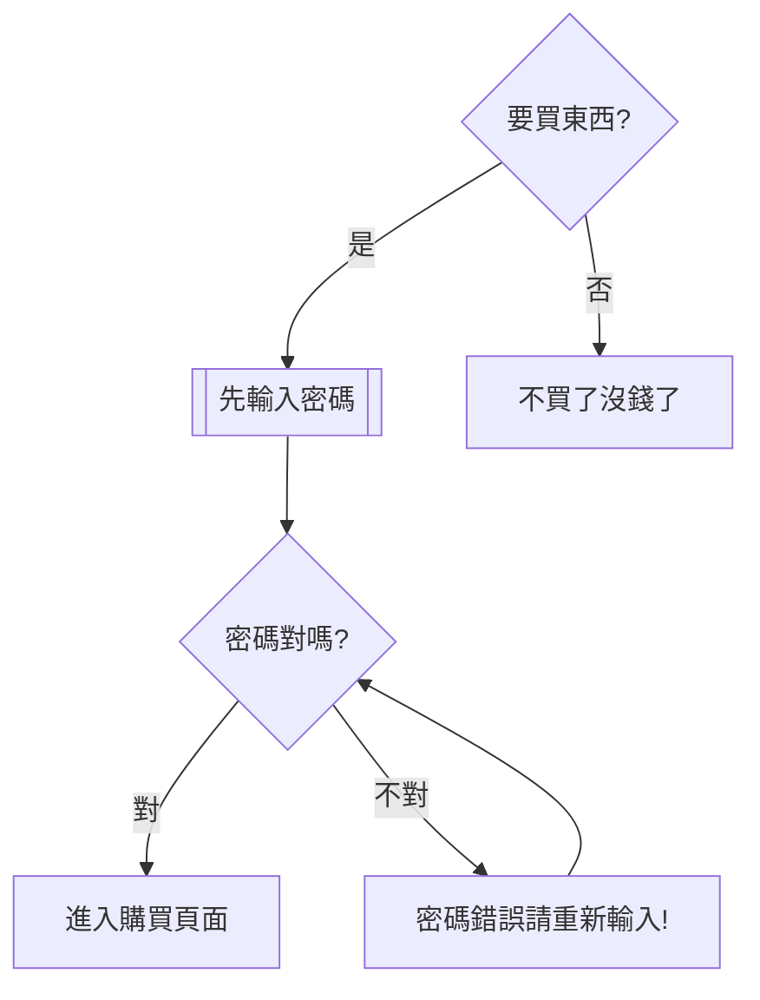

## Python 小科普

#### 變數
    標示符 => 自定義變量名稱 ，不可以數字開頭
    變量 => 儲存數據 => 容器
    變量可變 => 可重新賦值 => 每個變量都必須被賦值
    常量固定 => 不可被重新賦值 => 在python中沒有嚴格意義
    通常會將常量的標示符所有的字母全部大寫，當變量名字全部都大寫，標示符默認是一個常量，且不可修改數值。
    
    
```python=
#python無須指定變量類型
 price = 68.4 # float
 count = 2 # int 
 name = "meow" #str  '' "" "" """ """ 引號中的內容 都是字符串類型
 on_sale = True # 未知兩種結果 True / False bool
 
#通過type()查看變量類型
print(type(price))

#查看python已定義關鍵字，變數命名不可跟關鍵字重名
import keyword
print(keyword.kwlist) # 輸出關鍵字列表

['False', 'None', 'True', '__peg_parser__', 'and', 'as', 'assert', 'async', 'await', 'break', 'class', 'continue', 'def', 'del', 'elif', 'else', 'except', 'finally', 'for', 'from', 'global', 'if', 'import', 'in', 'is', 'lambda', 'nonlocal', 'not', 
'or', 'pass', 'raise', 'return', 'try', 'while', 'with', 'yield']

print(len(keyword.kwlist)) # 36

```

**變量輸出**

```python=
print("meow")
name = "ME"
age = 87
gender = 'boy'
print(name, age, gender) # Me 87 boy
print(name, age, gender,sep="") # Me87boy
print(name, age, gender,sep="*") # Me*87*boy
print(name, age, gender, sep="*", end="\n") #\n是跳行 , end="" 這樣的話不會換行輸出 

print("meow: \" I want eat some food! \"") # meow: " I want eat some food "
print('meow: \" I want eat some food! \"') #單雙引號嵌套使用  meow: " I want eat some food "
``` 
    
**字串拼接**   
```python=
a = "老"
b = "王"
c = 5487
print(a+b)
print(a*5) # 老老老老老
#print(a-b) #字串之間不可用 - 進行操作

# 格式化輸出 %s %d %f 輸出一個% => %%
# 站位符
print("你好! %s %s %s" % (a,b,c)) #你好! 老 王 5487 (這裡會將int強制轉成string)
```
**型態**
```python=
number_1 = 1234 #當我們想要輸出001234時...
print("我的學號是: %06d" % number_1) # %06d 輸出的十進制整數位6位,不足的位補0
score = 59.5
print("我期末英語成績 : %f" % score) # %f表示一個符點數，默認小數後面有6位 59.500000
print("我期末英語成績 : %.2f" % score) #只想小數後留2位 59.50

# 定義一個小數scale = 0.2, 輸出: 數據比例是20.00%
scale = 0.2
print("數據比例是: %.2f%%" % (scale*100))#數據比例是: 20.00% #scale*100 要加括號 否則 會把前面的話 輸出100遍 %%表示輸出一個%

```

**format**
```python=
name = "meow"
gender = '女'
age = 18

print("姓名: %s, 性別: %s:, 年齡: %d" %  (name,gender,age))

#{}不帶編號
print("姓名: {} ,性別: {} ,年齡: {}".format(name,gender,age))

#{1}{2}有數字標號的
print("姓名: {} , 性別:{},年齡: {}, 姓名是啥來著{}".format(name,gender,age,name))
#編號以0開頭 有了數字以後，變量就可以被反覆使用
print("姓名: {0} , 性別:{1},年齡: {2}, 姓名是啥來著{0}".format(name,gender,age,name))#姓名: meow , 性別:女,年齡: 18, 姓名是啥來著meow

#用數字標號表示會出現順序上的問題
#可以使用標示名稱的方式
print("姓名: {meow} , 性別:{xingbie},年齡: {age}, 姓名是啥來著{meow}".format(meow=name,xingbie=gender,age=age)) #姓名: meow , 性別:女,年齡: 18, 姓名是啥來著meow

#定義整數變量 student_no,輸出:我的學號000004
student_no = 4
print("我的學號: %06d" % student_no)
print("我的學號: {:06d}".format(student_no)) #我的學號: 000004

#定義小數price,weight,money, 輸出 : 波羅單價9.00元/斤,購買了5.00斤,需要支付45.00元9.00
price = 9.00
weight = 5.00
money = 45.00

print("波羅單價%.2f元/斤,購買了%.2f斤,需要支付%.2f元" % (price,weight,money))
print("波羅單價{:.2f}元/斤,購買{:.2f}斤,需要支付{:.2f}元".format(price, weight, money)) #波羅單價9.00元/斤,購買5.00斤,需要支付45.00元

# 定義一個小數scale = 0.2, 輸出: 數據比例是20.00%
scale = 0.2
print("數據比例是{:.2f}%".format(scale*100)) #數據比例是20.00%

```

**輸入**
```python=
# input 默認沒有提示語句
name = input()
print(name)

#給了提示語句會被打印出來，不會自動換行
name = input("輸入名字 :　")　＃把鍵盤輸入的str賦值給name
print(name)

#input語句接收的內容是以字串形式存在的
#類型轉換
int(x) #將x轉換為整數
float(x) #將x轉換為符點數
```

**項目演練**
```python=
#遊戲:被鵝追
#輸入玩家名稱:
#輸入密碼:
#輸入充值帳號:
print("被鵝追")
name = input("輸入玩家名稱: ") # 輸入玩家名稱: meow
passwd = input("輸入密碼: ")

print("%s 請充值才可加入遊戲! " % name) # meow 請充值才可加入遊戲! 
coins = input("輸入充值金額: ") # 輸入充值金額: 1000
coins = int(coins)#類型轉換
print("%s充值成功! 當前儲了:%d,請開始遊戲!" %(name,coins)) #meow充值成功! 當前儲了:1000,請開始遊戲!

#遊戲:英雄聯盟
#輸入角色
#輸入擁有裝備
#輸入想購買裝備
#輸入金額
print("英雄聯盟")
role = input("輸入角色: ")
equiment = input("輸入擁有裝備:　")
print("{}當前擁有{}".format(role,equiment))
upgrade_equiment = input("輸入想購買裝備: ")
pay = input("請輸入金額: ")
equiment = upgrade_equiment

print("{}擁有{},此裝備花了{}".format(role,equiment,pay))
```

**內存地址**
```python=
n = "meow"
s = n
print(n)

#每次運行都是不一樣的內存地址，但n跟s都會一樣的地址值，指向同個內存位置
print(id(n)) #2014419339760
print(id(s)) #2014419339760


n = "meow"
s = n
print(id(n)) #s = "meow" 1923566382832

n = "nomeow"
#n在內存中另外開了一個位址
print(id(n)) #n = "nomeow" 1923566382576
print(id(s)) #s = "meow" 1923566382832

#使地址反覆使用多次
money = 10
money1 = 10
print(id(money)) #1750925470288
print(id(money1)) #1750925470288

#但交互式interpreter時會因為數值過大而內存就會另開空間
meow = 1000000
meow1 = 1000000
print(id(meow))
print(id(meow1))

#使用交互式interpreter 開闢空間的方式 分為小整數和大整數空間
#使用小整數時會使用地址的覆用(-5~257)，大整數會重新開闢空間
```

**運算符**
```python=
# % ->取餘數
# // ->取商整數
#()中的運算符有最高優先權，再來是** > * > / > % > // > + > -

# 使用關係運算符的表達式最終返回一個 bool 型的結果 true False
a = 10000
b = 10000
a == b
>>　true　＃表示ａ、ｂ值相同

ａ is b #判斷a、b地址是否相同 is是身分運算符，用於判斷兩變量id
>> false

n1 = 8
n2 = 5 
n3 = 3
result = n1 >= (n2 + n3) and n1 > n2 #true and true => true

n2 += n3 #n2 = n2+n3 =>8
result = n1 >= n2 and n1 == n3 #true and false => false

n4 = (n1 + n3) - n2 #(8 + 3) - 8 =>3
result = n4 < n1 and (n4 + n3) > n2 #true and false => false

# if...else
a = 6
b = 5

#如果是true則將if前面的內容進行運算，並將結果賦值或成result
#如果是false則將else後面的內容進行運算，並將結果賦值或成result

result = (a + b) if a > b else (b - a)
print(result) #11

```
**條件判斷**

    if 搜索商品:
       先輸入密碼
       if 密碼正確:
          進入購買頁面
       else: 密碼錯誤，重新輸入密碼
    else: 不買了

```python=
#code 縮排為一個tab或四個空白鍵
#python規定: 判斷的變量是" "、0、 None默認是False，"meow"有值則認為是True

#登入頁面
username =  " " #默認表示False
if username != " ":
#if username: #username == False
    print("成功登入")
print("下次再來")

#小遊戲登入

print("*0"*10+"歡迎新玩家"+"*"*10)
level = input("請輸入當前級別(lv1、lv2)")
if level == "lv1":
    print("遊戲順利~")
else:
    print("請先充值")
    money = int(input("請充值: "))
    
    #再增加一個判斷:充值金額是否是50的倍數: 是:遊戲繼續 否:重新充值
    if money % 50 == 0:
        print("充值金額是{}元\n祝你遊戲愉快".format(money))
    else:
        print("重新充值，金額有誤")
       
#else: 猜數字
#產生一個隨機數
#鍵盤輸入一個數字
#將系統產生的數字和鍵盤輸入的數字做比較
#猜對了:中獎、猜錯了:掰掰下次再來

import random #亂數產生
run = random.randint(1,10) #產生1~10內的亂數
num = int(input("請輸入一個數字: "))

if num == run:
    print("猜中嘞")
else:
    print("猜錯嘞,再一次")
print("數字是{}".format(run))

#elif 多層條件判斷
考試成績評測
> 成績>=90 : A
> 90>成績>=80 : B
> 80>成績>=70 : C
> 70>成績>=60 : D
> 成績<60 :Ｅ

while True:
    score = input("輸入考試成績(1~100): ")
    test = int(score)
    if score.isdigit():
        if 0 < test <= 100:
            if test >= 90 and test >= 100:
                print("A")
                break
            elif test >= 80:
                print("B")
                break
            elif test >= 70:
                print("C")
                break
            elif test >= 60:
                print("D")
                break
            elif test < 60 and test >= 0:
                print("E")
                break
            else:
                print("請重新輸入正確數值")
                continue
        else:
            print("請輸入1~100內的分數")

```
    if 條件 1:
        #條件1滿足執行的代碼
        if 條件 1 基礎上的條件 2:
            ...#條件 2 滿足執行的代碼
        
        else: #條件 2 不滿足的處理
            條件 2 不滿足時，執行的代碼
    else: #條件 1 不滿足的處理
        條件 1 不滿足時，執行的代碼

**循環語句**
一般情況下，需要錯重複執行的code，都可以用循環的方式完成
(循環不是必要使用的，但是為了提高代碼的重複使用率，而使用)

```python=
for循環作為編程語言最強力的特徵之一
for循環較多用於次數可知情況下
python可以使用for語句循環遍歷整個序列的值

    關鍵字 元素 關鍵字 集合
    for   item  in    iterable:
        do something

range()函數 -> range(起始值 結束值,指定數字間隔)
該函數是python的內置函數，用於生成一系列連續的整數，大多用於for循環語句中
range(8) 起始值可以省略，默認從0開始 -->0,7 包前不包後，間隔可以省略，默認是1

#range(start, end, step= 1)
#range(start, end)
#range(end)

#range(0)是空集合

#打印三次hello

for i in range(3):  # 定義i，用於接收集合中的每一個元素，當接收一個元素時，就會執行一次
    '''
    i是一個變量 
    i = 0
    i = 1
    i = 2
    '''
    print("hello")  # 循環體


#小李超餓，要吃五個饅頭，顯示每次吃饅頭的過程，當小李吃完五個饅頭，顯示小李吃飽了

for i in range(1, 6):
    print("小李很餓，正在吃第{}個饅頭".format(i))
print("小李說:\"終於吃飽了\"")

'''
吃饅頭，在第三個饅頭上加了"砒霜"
當吃到了第三個饅頭的時候，提示:不要吃!有毒
'''
for i in range(1, 6):
    if i == 3:
        print("不要吃!有毒")
        break #結束循環，else內部語句就不會被輸出
    else:
        print("小李很餓，正在吃第{}個饅頭".format(i))
    
'''
用戶帳密登入只能登入三次，三次未成功則帳戶鎖定
輸入正確就進入後台
'''
for i in range(1, 4):
    inputlogin = input("請輸入帳號: ")
    inputpass = input("請輸入密碼: ")
    if inputpass == "admin" and inputlogin == "meow":
        print("成功登入")
        break
    else:
        print("請在輸入一次帳密")
else:
    print("帳號鎖定")
    
#pass空語句
if 10 > 7:
    print("結果正確!")

else:
   #正常來說如果這裡是空的，程序會報錯
    pass #不會做任何事情，相當於代碼的佔位，保證代碼結構的完整性，在語     法上也不會報錯
print("程序判斷成功")

#while較多用於次數未知情況下
while True: #True循環條件
    print("test")

#死循環 當循環條件一直為true，就會一直執行循環:並且沒有一個機制可以打破循環

#打印五遍meow
#1.定義重複次數計數器
i=0
#2.使用while判斷條件
while i < 5:
    #需要執行代碼
    print("meow")
    #處理計數器i
    i += 1
print("循環結束後的i = %d" % i )

# 不斷要求輸入學生姓名，輸入q結束
#以list()函數建立一個空的串列，然後透過append()方法函數把資料項目加到某一個指定的串列中。
allname = list() 
name = input("輸入名字: ")
while name != "q":
    allname.append(name)#append把指定的資料項加到串列的最後端
    name = input("輸入名字: ")
    if name == "q":
        print("程序結束")
print("您輸入的名字有:", allname)

#不斷要求用戶輸入一個數字，然後打印這個數字的兩倍，當用戶輸入q的時候程序退出

while True:
    num = input("輸入一個數字: ")
    if num == "q":
        print("程序結束")
        break
    print("您輸入的數字2倍是: %d" % (int(num)*2))

#打印1-30之間的所有3的倍數    
i = 1
while i <= 30:
    if i % 3 == 0:
        print(i)
    i += 1
    
#for 循環
for i in range(1, 31):
    if i % 3 == 0:
        print(i)
        
#水仙花數 自冪數 100-999 每個位的3次方，加起來還是他本身
# 153 = 1^3 + 5^3 + 3^3。
# 370 = 3^3 + 7^3 + 0^3。
# 371 = 3^3 + 7^3 + 1^3。
# 407 = 4^3 + 0^3 + 7^3。

#abc
#a = abc // 100
#b = (abc % 100) // 10
#c = abc % 10

i = 100
while i <= 999:
    ones = i % 10  # 個位
    tens = (i % 100) // 10  # 十位
    handreds = i // 100  # 百位

    if ones**3 + tens**3 + handreds**3 == i:
        print("水仙花數是: ", i)
    i += 1

#打印1-100的和
i = 1
result = 0  # 用來記錄算術和
while i <= 100:
    result = result + i  # 求和的累加
    i += 1

print("1-100之間的和是{}".format(result))

#不使用自符串拼接，在控制台連續輸出五行 "*",每一行 "*" 的數量一次遞增
'''
*
**
***
****
*****
'''
i = 0
while i < 5:
    i += 1
    print("*"*i)
#循環嵌套 外循環五次 內循環打印多少個 * 還要和外循環的次數相同
i = 1
while i <= 5:
    # 內循環
    j = 1
    while j <= i:
        print("*", end="")
        j += 1
    print("")  # 什麼都不打印，但要換行
    i += 1


#輸出99乘法表
i = 1
while i <= 9:
    # 內循環
    j = 1
    while j <= i:
        print("{}*{}={}".format(j, i, i * j), end="\t")
        j += 1
    print("")  # 什麼都不打印，但要換行
    i += 1

 ```
 ```mermaid
 flowchart LR
    a(i+1)-->b{i<=9}
    b-->|false|c(停止運行)
    b-->|true 進入內迴圈|d(j=1)
    direction BT
    d-->e{j<=1}
    e-->|true|f(輸出i*j且j+1)
    e-->|false|g(i+1)
    g-->|回到外迴圈繼續執行|b
 ```

